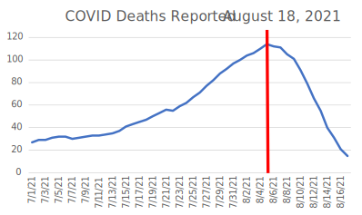

# VisLies 2021 Gallery

It was another great year of lies.
Unfortunately, COVID-19 once again prevented us from meeting in person.
But, nevertheless we were able to meet virtually and share the fun VisLies we found during the previous year.

## Stop, Go, and Not Stop

[Ken Moreland] has had diseases on his mind, so he started us off with this interesting example showing us prevalence of hepatitis A antibodies.
This graphic features a [choropleth map] with 4 color categories: High, Intermediate, Low, Very Low.
These categories have a clear order.
However, take a close look at the colors chosen.
The red, yellow, and green colors are a standard set of colors that most people will grok meaning from.
But while red is used for "high", a very similar orange is used for "very low".
Why are to two values at the opposite have almost identical colors?
It makes the lowest values look like the highest values.

[Ken Moreland]: http://www.kennethmoreland.com/
[choropleth map]: https://en.wikipedia.org/wiki/Choropleth_map

## Not the Flu

Of course, the disease that is on all of our minds is COVID-19.
[Ken Moreland] next presented this graphic, which was originally features in a [_Time_ magazine article] and later highlighted in [a blog post by Stephen Tracy].
The graphic is showing a series of pie charts showing the fraction of fatal cases per viral infection.

The article observes that the measured mortality rate of COVID-19 is closer to the seasonal flu than to other recent more deadly viruses like SARS and MERS concluding that "Even when taking the current estimated global mortality rate of 3.4% at face value, COVID-19 looks more like influenza than other once-novel coronaviruses."
That, unfortunately, has proven to be gravely untrue.
As of November 2021, there have been over 250 million COVID-19 deaths worldwide.
This staggering number far exceeds the [total number of SARS deaths during the 2003 outbreak] (774), the [total number of MERS deaths] (888), and [estimated global seasonal influenza deaths] (290,000 -- 650,000 per year).

What went wrong?
One problem is that the comparison of fatality rates between COVID-19 and seasonal flu are somewhat uncomparable.
Flu fatality is averaged over years of observation whereas at the time of this article COVID-19 there were only a few months of preliminary data.

But a bigger issue is that the measurement presented in the graphic, percentage of fatal cases, might not be indicative of the total number of fatalities.
To total number of fatalities is determined by both the case fatality rate _and_ the infectivity rate (typically measured by the [R-naught value]).
A disease with a 100% case fatality might not actually kill a lot of people if it does not spread well.
In fact, a high fatality might lead to a lower infection rate because victims die before infecting others.

## A Bigger Pool

<!--
The previous VisLie was actually dated.
This visualization was formed at the beginning of the COVID-19 pandemic when there was neither much understanding nor data available.
So, we can forgive those hopefuls that were overly optimistic.

But what of today?
After a year worth of data collection and research, the COVID-19 pandemic, its dangers and recommendations for it, is still a divisive topic.
Surely, there 
-->

Continuing on the theme, [Ken Moreland] presented this simple [choropleth map] demonstrating the number of confirmed COVID-19 cases in the US.
On the surface, this seems like a straightforward representation.
But on closer inspection, there is a serious problems.

All the numbers are given in terms of absolute cases since the beginning of the pandemic.
This is misleading for 2 reasons.
First, this is heavily biased toward the population of the region.
Higher populations will naturally have larger numbers even if the infection rate is about the same.
The infections in several of the highly populated states are larger than the entire population of Wyoming.
The second problem is that the numbers combine an accumulation of a years worth of data.
That's OK for some questions, such as a post-mortem of the policies from start to end.
But this might not be very indicative of how things are right _now_.
This includes many cases at the beginning of COVID-19 where conditions were very different.

In contrast, here is a similar map that corrects these two problems.
This map provides numbers per capita and on a sliding 7 day window.
Where in the first map, CA, TX, and FL were all near the top of the infection rates, recent per capita data says that the CA infection rate is way down, TX is in the middle, and FL (the lowest of the 3) is currently one of the worst in the country.
I also note that some more sparsely populated areas like West Virginia and the Dakotas look pretty good by absolute numbers but not so great per capita.

It should be pointed out that some VisLies participants noted that the color scale of this plot is a little weird.
The ranges are oddly precise, there are also odd gaps between each region, and the range for each color is inconsistent.
Likely, the states and territories were divided into 6 even(ish) groups.

So, what is so bad about providing data that is not scaled per capita?
This pithy infographic does a great job describing just what can go wrong.
In a nutshell, a count of just about anything related to people will be proportional to the population count.
This means pretty much anything can be "proven" despite how ridiculous the relationship might be.

[_Time_ magazine article]: https://time.com/5798168/coronavirus-mortality-rate/
[a blog post by Stephen Tracy]: https://analythical.com/blog/covid19-in-charts
[total number of SARS deaths during the 2003 outbreak]: https://www.who.int/publications/m/item/summary-of-probable-sars-cases-with-onset-of-illness-from-1-november-2002-to-31-july-2003
[total number of MERS deaths]: https://applications.emro.who.int/docs/WHOEMCSR471E-eng.pdf?ua=1
[estimated global seasonal influenza deaths]: https://www.who.int/influenza/Global_Influenza_Strategy_2019_2030_Summary_English.pdf
[R-naught value]: https://globalhealth.harvard.edu/understanding-predictions-what-is-r-naught/

## Correlations and Causations

Not satisfied with the lies he found in the wild, [Ken Moreland] constructed a VisLie of his own.
Using data from the [CDC Data Tracker], he pulled information about the number of people vaccinated in each US state as well as the total number of COVID-19 deaths that occurred in the state.
Plotting these together, we get a clear positive correlation between the two.
It seems like vaccines are killing the very people they are supposed to protect.

This previous statement is provably false.
[Studies on COVID-19 vaccine effectiveness] show the opposite: The vaccines are reducing the number of deaths, even [in the face of the delta variant].
The problem with this plot is the same as the [previous choropleths].
As before, a count of just about anything related to people will be proportional to the population count.
This means pretty much anything can be "proven" despite how ridiculous the relationship might be.

This next plot fixes the problem.
Instead of giving a full count of people vaccinated and dead, the plot measures each of these per capita.
Now that we have taken population out of the equation, we see the correlation is reversed.

In a demonstration of how tricky these correlations can be, Pat Crossno provided this plot from [a recent publication].
The plot shows similar metrics from a [similar data set], but the correlation is reversed.

Ken later did a deep dive that looks more closely into this data.
You can read the details [in his blog].
In short summary, a big point to note is that this plot is comparing COVID-19 infections rather than COVID-19 deaths, and it is possible that the vaccines are less effective with preventing infections than it is with sickness and death.
But that said, the measurements for COVID-19 cases are affected by the number of tests being performed.
So this plot is likely showing that countries that give more vaccinations also test more people.

[CDC Data Tracker]: https://covid.cdc.gov/covid-data-tracker/
[Studies on COVID-19 vaccine effectiveness]: https://www.cdc.gov/coronavirus/2019-ncov/vaccines/effectiveness/index.html
[in the face of the delta variant]: https://dx.doi.org/10.1056/NEJMoa2108891
[previous choropleths]: #a-bigger-pool
[a recent publication]: https://link.springer.com/article/10.1007%2Fs10654-021-00808-7
[similar data set]: https://github.com/owid/covid-19-data/tree/master/public/data
[in his blog]: http://www.drmoron.org/vaccine-correlations/

## Hurry Up and Wait

The plot here shows the number of deaths (7-day average) [reported for the state of Florida] on August 18, 2021.
According to this data, the tragedy peaked on August 5 (indicated by the read line) and was in steady decline up to the point the data were collected.

But now look at data collected from the same source on September 27.
A plot with this data is shown here, also with a red line on August 5.
Where the previous data indicated that the number of deaths began to trend downward, we see in this graph the tragedy continued to grow into September with the number of daily deaths eventually tripling by September.

So what gives?
The problem is that the deaths are being grouped by the date the death happened, not the date the death was reported.
Because there can be a delay from the time someone dies to when a COVID test happens and is finally reported.
It can take up to a week for the reports for all COVID deaths in a given day to come in.
Consequently, the last several items in the report are unreliable.
When plotting data of this nature, it should be made clear that the tail end of the data is incomplete (or leave them out of the plot).

This effect was shown to us by [David Borland] who shared with us this plot [originally posted by Jordan Mendelson].
This graphic was originally created as a criticism with how Florida changed their reporting to be by the day the death occurred rather than when the death was reported.
Others have pointed out [this criticism is probably unfounded] as reporting by the day of death is common practice from many states ([including California]) and is arguably better from a historical perspective.

Regardless of the reasons, this is a great reminder to be skeptical of data that is in the process of being collected.
The most recent values are likely to be incomplete, which makes the ending trend unreliable.

[reported for the state of Florida]: https://covid.cdc.gov/covid-data-tracker/#trends_dailycases
[originally posted by Jordan Mendelson]: https://observablehq.com/@aloisius/floridas-illusion-of-recovery
[this criticism is probably unfounded]: https://www.wsj.com/articles/florida-covid-19-death-coronavirus-reporting-change-miami-herald-journalist-desantis-11630537356
[including California]: https://covid19.ca.gov/state-dashboard/

## Invalid Summary

[Bernice Rogowitz] had a bone to pick with her brokerage firm. In their mobile app they provide a convenient summary of her portfolio like that shown here.
How convenient!
The graphic shows that her portfolio is divided among 3 different asset classes and that the portfolio is "Conservative."

But wait.
A closer look reveals that the largest, orange bar is labeled "unknown."
That's odd.
If Bernice is holding positions at her own brokerage firm, how can they be "unknown?"

And if 64% of the positions are "unknown," how are they computing the average risk?
Fortunately, Bernice is paying more attention to her assets than her brokerage firm and knows that these "unknown" positions are actually  leveraged technology ETFs.
This means that this "conservative" portfolio is _64% high risk_.

So, the summary provided is completely off base.
Fortunately, Bernice is knowledgeable enough to know that the summary provided is utter nonsense.
But a more casual investor could be completely mislead with their investments.

[Bernice Rogowitz]: https://sites.google.com/site/bernicerogowitz/

## Even Worse Pie Chart

Speaking of the same brokerage firm app, [Bernice Rogowitz] found even more unsatisfactory presentations.
VisLies has never been a fan of pie charts, but this mobile app's interface somehow manages to make it worse.
Looking at the pie chart on the left, you will see that although the meaning of each wedge is listed underneath the pie, there is no indication of which wedge goes with which label. The labels are not attached to the wedges, and there is no color indication next to the labels.

The only way to identify what category is associated with a wedge is to click on it to get a tooltip.
Can you identify one wedge and then use that to determine the labels for the rest of the wedges based on order?
Nope.
The wedge order is not the same as the label order.

So there is no way to make any sense of the chart without individually clicking on each of the wedges one by one.
Which begs the question, what is the point?

## Financial Security Blanket

[Bernice Rogowitz]'s woes with finance visualizations did not stop there. Bernice has a bone to pick with a trend for financial consultants: the asset allocation quilt.

(Before continuing, it should be noted that although this section will be touching on looking at various investments, _this is not financial advice_. We are not financial advisors or qualified for financial advice in any ways. We are simply demonstrating data display.)

Here is an example of an asset allocation quilt that a financial adviser might show you. (You may need to click on it to see details.) The asset allocation quilt is meant to show you the historical performance of a set of investments that are available and, more to the point, convince you to invest in their strategy that they will mange for you.

If you have not yet been presented with an asset allocation quilt, some explanation is probably necessary. As you can see, the asset allocation quilt is arranged in a grid. Each column represents a time frame (e.g. a year), and each investment type is listed in the column's cells in the order of performance. Each investment type is given its own unique color, which makes trends easier to follow (and gives the display its name).

The point a financial adviser might make with this quilt is to demonstrate that markets can be volatile, but their management can find the sweet spot for consistent performance. in the case for this quilt, the financial advisor wants to show the "Asset Alloc." colored in light gray. To make it easier to follow, here the featured investment is connected by lines. As can be seen by the graph, the featured asset allocation is consistently in the middle of the graph, showing less volatility than the other investments.

But how much can we trust this display? Let's take a look at the highest peak, which occurs in the year 2008. Even though it is listed as the "best" year in this display, a closer look reveals that the return in this year was -25.4%. 2008 was a year of financial crisis in the U.S., so this investment lost a quarter of its value. But because it performed marginally less worse than the others, it appears as a "good" year.

We can partially correct the problem by adjusting the quilt to align the zero value. Now the "quilt" is no longer in a rectangular field. It is now clear when an investment grows vs when it shrinks and gives a better indication of the volatility of each.

But even with this correction, the display is still problematic. Even though each value is on the correct side of zero, the position of each cell is not necessarily reflective of the magnitude of the return. A stable investment can be made to look less stable as other investment returns swing above and below it.

A much better representation is a tool we have been using all along: a simple x-y plot. Here we can see the relative magnitudes of each of the investments and make determinations about their relative returns.

If we focus on a few investments, we see that the asset allocation has about the same volatility as the US equities, but with smaller returns.

Of course, what ultimately matters is not the year-to-year performance but the overall return on investment. To know how much an investment earns, you need to calculate the cumulative gains (or loss), which once again is best represented by a traditional x-y plot.

As we can see here, the asset allocation is not particularly special. The US equities were better performing without the volatility of investments like emerging markets. (Reminder: This is not financial advice. This is an example of data display, not claims about any particular investment.)

So, as can be seen, the asset allocation quilt makes a story that is easy to see with a proper x-y plot more complicated than it needs to be.

## At Least it Looks Green

Just before the VisLies event [Ben Simons] encountered this unhelpful information about the Australian plan to reach zero emissions. For context, this visualization was used during [this news report] proceeding Scott Morrison's (Australian prime minister) [begrudging attendance] of the Glasgow COP26 conference. What we are seeing is an overview of the plan to reduce Australia's carbon emissions. The display is just a one-row table, but gosh it looks pretty.

Despite its simplicity, this graphic is difficult to interpret. If you add up the numbers, you get an emissions reduction of... up to 110%?

As ambitious of a goal that is, Australia is probably not planning to address more than all of its carbon emissions. Note that the first entry is "Reductions to date" (where somehow "today" is one year before the report was released). It's likely that the other reductions are in proportion to the carbon emissions of today, so we can discount the initial "-20%" of carbon emission reductions from today.

But that raises an interesting question of how to interpret the remainder of the numbers. Are those percentages with respect to the carbon emissions of today or of the projected emissions at the time they are implemented. For example, for the -15% emissions labeled "Global tech trends," is that 15% off the emissions of today, or 15% off what is left after the 40% from technology investments (that is, 15% of 60% of what we have today)? If the reductions are applied sequentially, the overall reduction can be as low as 61%.

Ben also notes that much of the plan relies on happenstance technology improvements that are innovated by others ("Global tech trends") and future technology we assume will happen ("New tech"). It may be the case that the "Offsets" category is placed where it is based off technology improvements that we assume will happen.

In fairness, this graphic was created in response to a plan that was [criticized for being vacuous on substance] and was, in retrospect, [never intended to be implemented].

[Ben Simons]: mailto:bsimons@acm.org
[this news report]: https://drive.google.com/file/d/13zBE2UEWIpTB3shRUiHr9UDm34Aur3FL/view?usp=sharing
[begrudging attendance]: https://apnews.com/article/climate-change-environment-and-nature-australia-europe-glasgow-a6373b989439b376a43d6c5be9d95421
[criticized for being vacuous on substance]: https://www.theguardian.com/environment/2021/nov/03/the-pm-goes-to-glasgow-or-what-scott-morrison-didnt-do-at-cop26
[never intended to be implemented]: https://www.washingtonpost.com/world/2021/11/15/australia-coal-scott-morrison-cop26/

## Not as Cool as you Think

[David Borland] just got a new air conditioner. With it came a fancy new thermostat that records usage and comes with an app that allows you to review the energy consumption.

But [David][David Borland] noticed something odd about the reports he was getting. In each bar chart is a dotted line that would seem to suggest some sort of trend or average. But in examples like this, that cannot be the case as the dotted line is clearly lower than all the bars. Such a value cannot, by definition, be an average.

Looking deeper into the reports, [David][David Borland] found these details that seem to explain how this line came about. The numbers here correspond to the bar chart shown. The total value does seem to be the sum of the 3 bars. The "average" is the total divided by 7, the number of days in a week. That makes sense for data on a week that has already passed, but it is utter nonsense to consider days that have not yet happened for the average. The supposed average is just a useless item of non-information that is best ignored.

[David Borland]: https://renci.org/staff/david-borland/

## Less Energy, Smaller Home

[Laura Tateosian] recently received this summary as part of her energy usage report.
The text is clear enough; it compares her energy use with that of an "efficient home."
But the text is accompanied with a couple of icons in the shapes of houses that represent the two numbers being provided, and these icons make little sense.

The icons are different sizes, and the smaller size does indeed represent the smaller number.
But the relationship to the numbers end there.
The smaller number is about 40% that of the larger number, so you would think that the sizes of the icons would be somehow proportional.
The top of the smaller house is more than 40% than the top of the larger house.
Likewise, the proportions of the height of the eaves is wrong.
As far as we can tell, there appears to be no logical measurement of the icons to match the proportions of the numbers.

The icons are clearly meant to show the relative values of the numbers, but in no way do they actually do that.

[Laura Tateosian]: https://lgtateos.github.io/tateos/
